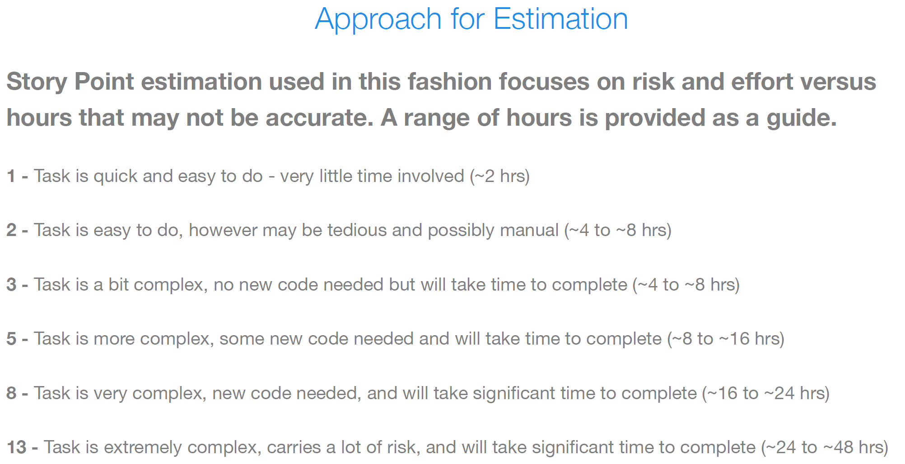

# Demoulas Profit Sharing Project

## Project Links

- **Blue QA:** [http://appa84d:8080/home.seam?cid=4413](http://appa84d:8080/home.seam?cid=4413)
- **Confluence:** [NGDS Profit Sharing Documentation](https://demoulas.atlassian.net/wiki/spaces/NGDS/pages/29853053/NGDS+Profit+Sharing+Documentation)
- **Jira:** [Project PS Board](https://demoulas.atlassian.net/jira/software/c/projects/PS/boards/24)
- **Bitbucket:** [Smart Profit Sharing Repository](https://bitbucket.org/demoulas/smart-profit-sharing)

- **QA URL:** [Profit Sharing QA](https://ps.qa.demoulas.net/)
- **Developer Setup:** [developer_setup/README.md](./developer_setup/README.md)

## Documentation

### Quick References

- **[Code Review Checklist](https://demoulas.atlassian.net/wiki/spaces/NGDS/pages/CHECKLIST)** - Master checklist for PR reviews (security, architecture, telemetry, testing)
- **[Project Instructions](./copilot-instructions.md)** - Core architecture patterns, security requirements, and coding standards
- **[AI Assistant Guidelines](./CLAUDE.md)** - AI coding agent operational rules and patterns

### Telemetry & Observability

- **[Telemetry Guide](./src/ui/public/docs/TELEMETRY_GUIDE.md)** - Comprehensive telemetry implementation for developers, QA, and DevOps (75+ pages)
- **[Telemetry Quick Reference](./src/ui/public/docs/TELEMETRY_QUICK_REFERENCE.md)** - Developer cheat sheet with copy-paste examples
- **[Telemetry DevOps Guide](./src/ui/public/docs/TELEMETRY_DEVOPS_GUIDE.md)** - Production operations, monitoring, and alerting setup
- **[Security Telemetry Setup](./src/ui/public/docs/SECURITY_TELEMETRY_SETUP.md)** - Advanced security monitoring patterns

### Feature-Specific Guides

- **[Read-Only Functionality](./src/ui/public/docs/READ_ONLY_FUNCTIONALITY.md)** - Complete guide to read-only role implementation
- **[Read-Only Quick Reference](./src/ui/public/docs/READ_ONLY_QUICK_REFERENCE.md)** - Quick implementation guide
- **[Distribution Processing Requirements](./src/ui/public/docs/Distribution-Processing-Requirements.md)** - Distribution processing flows
- **[Year-End Testability and Acceptance Criteria](./src/ui/public/docs/Year-End-Testability-And-Acceptance-Criteria.md)** - Year-end processing tests

### Backend Architecture

- **[Security Guidelines](./.github/instructions/security.instructions.md)** - Comprehensive security patterns (OWASP Top 10, STRIDE, Defense in Depth)
- **[RESTful API Guidelines](./src/services/src/Demoulas.ProfitSharing.Endpoints/.github/instructions/restful-api-guidelines.instructions.md)** - Zalando RESTful API design, HTTP semantics, endpoint patterns
- **[EF Core 10 Patterns](./copilot-instructions.md#ef-core-10-patterns--best-practices-mandatory)** - Database access patterns, query optimization, bulk operations
- **[Distributed Caching Patterns](./DISTRIBUTED_CACHING_PATTERNS.md)** - IDistributedCache patterns, version-based invalidation
- **[Validation Patterns](./VALIDATION_PATTERNS.md)** - Server & client validation, FluentValidation examples

### Frontend Development

- **[Frontend Unit Tests](./ai-templates/front-end/fe-unit-tests.md)** - React testing patterns
- **[Navigation Setup](./ai-templates/front-end/fe-navigation.md)** - Navigation system configuration
- **[Redux Setup](./ai-templates/front-end/fe-redux-setup.md)** - Redux Toolkit and state management
- **[Type Patterns](./ai-templates/front-end/fe-types.md)** - TypeScript type definitions and patterns

### Project Documentation

- **[PS-1623 Read-Only Summary](./PS-1623_READ_ONLY_SUMMARY.md)** - Executive summary of read-only role implementation
- **[Branching and Workflow](./BRANCHING_AND_WORKFLOW.md)** - Git branching, Jira integration, PR conventions

### Instruction Files (for Developers)

- `.github/instructions/fullname-pattern.instructions.md` - Standard naming conventions for names

## Definition of Ready (DoR)

The project Definition of Ready is maintained as a standalone guide:

- **[Definition of Ready (DoR)](./docs/DEFINITION_OF_READY.md)**

## Definition of Done (DoD)

The project Definition of Done is maintained as a standalone guide:

- **[Definition of Done (DoD)](./docs/DEFINITION_OF_DONE.md)**

## Code Review and Pull Request Guidelines

> **Use the [Master Code Review Checklist](./CODE_REVIEW_CHECKLIST.md)** for comprehensive PR reviews. It covers all security, architecture, frontend, backend, and telemetry requirements.

### Pre-Submission Checklist (Developer)

- [ ] All acceptance criteria implemented and tested
- [ ] Code follows `.editorconfig` formatting rules
- [ ] No security warnings or analyzer violations
- [ ] No hardcoded secrets or sensitive data in code
- [ ] Unit/integration tests added with >80% coverage for new code
- [ ] AsyncFixer01 compliance verified (single awaits return Task directly)
- [ ] Telemetry implemented on all new endpoints
- [ ] No PII in logs (mask SSN, email, phone, names)
- [ ] Documentation updated
- [ ] Branch up-to-date with `develop`

### Critical Security Requirements (MANDATORY - OWASP Top 10 2021)

**🚨 AUTO-REJECT if any of these are violated:**

#### A01/A07: Authentication & Authorization

- [ ] **Server-side role validation ALWAYS:** Never trust client-provided roles in headers
  ```csharp
  // ❌ WRONG: var roles = req.Headers["x-impersonating-roles"];
  // ✅ RIGHT: var allowedRoles = GetUserAllowedImpersonationRoles(userId);
  ```
- [ ] **No localStorage auth elevation:** Tokens/roles never determine access based on localStorage
- [ ] **Centralized validation:** Use `PolicyRoleMap.cs` for all authorization decisions
- [ ] **Re-validate impersonation:** When handling impersonation, always re-check authenticated user permissions

#### A02/A05: Transport Security

- [ ] **HTTPS enforcement** (at load balancer)
- [ ] **Security headers present:** `X-Frame-Options: DENY`, `X-Content-Type-Options: nosniff`, `CSP`, `HSTS`
- [ ] **CORS restricted:** No `AllowAnyOrigin()`; dev uses `localhost:3100` only
- [ ] **No exposed stack traces** in error responses

#### A03/A09: Input Validation & SQL Injection

- [ ] **Server-side validation MANDATORY:** All user inputs validated (not client-side only)
- [ ] **Parameterized queries only:** EF Core auto-parameterizes; NEVER build SQL strings manually
- [ ] **Boundary checks:** Numeric ranges (1-1000), string lengths, collection sizes
- [ ] **Degenerate query guards:** Prevent queries scanning entire tables (e.g., badge != 0)
- [ ] **No raw SQL:** If needed, fully parameterized in service layer only

#### A01/A09: PII Protection & Data Exposure

- [ ] **PII masked in logs:** SSN `123-45-6789` → `***-**-6789`, email masked, names masked
- [ ] **No sensitive data in errors:** Stack traces, SQL, file paths, PII never exposed
- [ ] **Proper composite keys:** Demographics dictionaries use `(Ssn, OracleHcmId)` not just `Ssn`
- [ ] **Read-only contexts:** `UseReadOnlyContext()` for query-only operations
- [ ] **Sensitive fields declared in telemetry:** All PII fields accessed listed ("Ssn", "Email", "FirstName", "LastName", "FullName")

#### Frontend Critical: Age Calculation

- [ ] **❌ AUTO-REJECT: Age NEVER calculated in frontend** (JavaScript/React)

  ```typescript
  // ❌ WRONG - BLOCKING: Frontend age calculation from DOB
  const age = Math.floor(
    (Date.now() - new Date(dob).getTime()) / (1000 * 60 * 60 * 24 * 365.25)
  );

  // ✅ RIGHT: Display DOB only, backend provides age if needed
  const dobDisplay = dateOfBirth ? mmDDYYFormat(dateOfBirth) : "N/A";
  ```

  **Why:** Frontend age diverges from backend (timezone/timing), bypasses access control, breaks PII masking rules.

### 1. Code Correctness & Functionality

- [ ] Code meets intended functionality with all acceptance criteria met
- [ ] Logic errors, edge cases, and potential bugs identified and fixed
- [ ] Boundary conditions handled (null values, empty collections, zero values)
- [ ] Error handling complete with proper error codes
- [ ] Test coverage adequate for new/changed code

### 2. Code Quality & Standards

- [ ] **File-scoped namespaces** (not block-scoped)
- [ ] **One class per file**
- [ ] **Explicit access modifiers** on all types/members
- [ ] **Naming conventions:** PascalCase public, `_camelCase` private, `s_` static
- [ ] **`readonly` used** for immutable fields
- [ ] **`is null`/`is not null`** preferred, **NO `??` in EF queries**
- [ ] **XML doc comments** on public/internal APIs
- [ ] **No duplicate code** (DRY principle)
- [ ] **SOLID principles** applied

### 3. Backend Architecture

- [ ] **No DbContext in endpoints:** All EF Core in service layer only
- [ ] **Services return `Result<T>`:** Typed results for error handling
- [ ] **AsyncFixer01 compliance:** Single awaits return `Task` directly (no async wrapper)
- [ ] **Async/await used correctly:** `FirstOrDefaultAsync`, `ToListAsync` (not synchronous variants)
- [ ] **Explicit includes:** `Include()`/`ThenInclude()` used (no lazy loading)
- [ ] **Query tagging:** `TagWith()` includes business context (year, operation, ticket)
- [ ] **Bulk operations:** `ExecuteUpdateAsync`/`ExecuteDeleteAsync` for efficiency
- [ ] **Dependency injection:** Constructor injection for all dependencies
- [ ] **Mapperly used:** For DTO↔entity mapping (no duplicate mapping logic)

### 4. Frontend Architecture

- [ ] **Functional components:** Hooks, not class components
- [ ] **TypeScript strict mode:** All props/state typed (no `any`)
- [ ] **Redux Toolkit:** API/data logic in `reduxstore/`; RTK Query preferred
- [ ] **Tailwind utilities:** Utility-first; no inline styles for reusable patterns
- [ ] **No unmasked PII:** Console logs and error messages mask SSN, email, phone, names
- [ ] **No direct fetch:** Use RTK Query hooks instead

### 5. Database & EF Core (MANDATORY)

- [ ] **`UseReadOnlyContext()`:** For read-only operations (auto-applies `.AsNoTracking()`)
- [ ] **NO manual `AsNoTracking()`:** When using `UseReadOnlyContext()` (redundant)
- [ ] **Query tagging present:** `TagWith($"Context-{year}")` for tracing
- [ ] **Composite keys for Demographics:** Use `(Ssn, OracleHcmId)` not just `Ssn`
- [ ] **No `??` in queries:** Oracle provider fails; use explicit conditionals instead
- [ ] **Migrations tested:** Applied to dev database; naming is imperative/singular
- [ ] **History tracking maintained:** Close current record, insert new row (never overwrite)

### 6. Telemetry & Observability (MANDATORY)

**All new endpoints MUST implement comprehensive telemetry.**

- [ ] **`ExecuteWithTelemetry` used** or manual `TelemetryExtensions` methods called
- [ ] **Logger injected:** `ILogger<TEndpoint>` in constructor
- [ ] **Business metrics recorded:** `EndpointTelemetry.BusinessOperationsTotal.Add()` called
- [ ] **Record counts tracked:** `RecordCountsProcessed.Record()` for data volumes
- [ ] **Sensitive fields declared:** List ALL PII fields accessed ("Ssn", "Email", "FirstName", "LastName", "FullName", etc.)
- [ ] **Exception handling:** Errors correlated with activity and logged
- [ ] **Telemetry tests:** Unit tests verify activity/metrics recording
- [ ] **Business operation labels** use standard names (year-end, reports, lookups, etc.)

### 7. Validation & Error Handling

- [ ] **FluentValidation** used for all request DTOs
- [ ] **Server-side validation MANDATORY:** Not just client-side (security)
- [ ] **Boundary checks:** Ranges (1-1000), lengths, collection sizes validated
- [ ] **Domain errors used:** `Error.MemberNotFound` instead of generic messages
- [ ] **Problem JSON format:** RFC 7807 structure for error responses
- [ ] **No sensitive data in errors:** PII, stack traces, SQL never exposed
- [ ] **Correlation IDs:** All errors include correlation for tracing

### 8. Performance & Optimization

- [ ] **No N+1 queries:** Lookups pre-computed; explicit `Include()`/`ThenInclude()`
- [ ] **Projection used:** Select only needed columns for DTOs
- [ ] **`IDistributedCache` only:** NOT `IMemoryCache`
- [ ] **Version-based cache invalidation:** Not pattern-based deletion
- [ ] **Degenerate query guards:** Input validation prevents table scans
- [ ] **Async throughout:** `ConfigureAwait(false)` in library/service layer

### 9. Testing

- [ ] **Backend unit test split (no ad-hoc projects):**
  - `Demoulas.ProfitSharing.UnitTests` for functional unit/service tests
  - `Demoulas.ProfitSharing.UnitTests.Architecture` for analyzer/infrastructure/architecture guardrail tests
- [ ] **`Description` attribute:** Tests tagged with Jira ticket `[Description("PS-1234 : Description")]`
- [ ] **Async tests:** `async Task` for async operations
- [ ] **Meaningful test names** describing what's tested
- [ ] **Arrange-Act-Assert:** Clear test structure
- [ ] **Edge cases covered:** Nulls, empty collections, boundary values
- [ ] **Telemetry verified:** Tests check telemetry integration
- [ ] **Test coverage:** >80% for new code critical paths

### 10. Documentation

- [ ] **XML doc comments:** Public/internal APIs documented
- [ ] **Complex logic explained** with inline comments
- [ ] **README/external docs updated** as needed
- [ ] **Release notes** prepared if user-facing
- [ ] **Instruction files updated** if new patterns introduced

### 11. Git Workflow & Branching

- [ ] **Branched from `develop`:** Never from `main`
- [ ] **Branch naming:** `feature/PS-1234-description` (kebab-case)
- [ ] **Commit messages:** Start with Jira key `PS-1234: Description`
- [ ] **PR title:** Starts with Jira key
- [ ] **PR description:** What changed, why, testing done
- [ ] **Deviations explained:** Reasoning for any pattern deviations
- [ ] **No force push:** To shared branches
- [ ] **Clean history:** Logical commits, rebased if needed

### 12. Compatibility & Dependencies

- [ ] **Backward compatibility:** Existing APIs not broken
- [ ] **Dependency updates:** Version changes documented and tested
- [ ] **No unnecessary packages:** Added dependencies justified
- [ ] **No dev dependencies in production:** Test packages excluded from prod builds

### 13. Compliance & Standards

- [ ] **`.editorconfig` rules followed:** Formatting, naming, braces
- [ ] **No security analyzer warnings:** Warnings treated as errors
- [ ] **OWASP Top 10 considerations:** Authentication, validation, data exposure reviewed
- [ ] **Legal/regulatory compliance:** SOX, GDPR, privacy considerations met
- [ ] **Data retention policies:** Understood and implemented

---

### Review Workflow

**For Small PRs (< 5 files):** Focus on Security, Code Quality, Testing

**For Medium PRs (5-20 files):** Add Architecture, Telemetry, Validation

**For Large PRs (20+ files/new features):** Review ALL sections including documentation

### Common Rejection Reasons

- ❌ **Age calculated in frontend** (auto-reject—security critical)
- ❌ **DbContext in endpoints** (move to service layer)
- ❌ **Client-side auth trust** (re-validate server-side)
- ❌ **Unmasked PII in logs** (use masking functions)
- ❌ **Missing telemetry** (required on all endpoints)
- ❌ **AsyncFixer01 violations** (single awaits return Task directly)
- ❌ **No server-side validation** (all inputs must be validated)
- ❌ **Hardcoded secrets** (use Key Vault/user secrets)
- ❌ **`??` in EF queries** (use explicit conditionals for Oracle compatibility)
- ❌ **No composite keys for Demographics** (use `(Ssn, OracleHcmId)`)

---

**Reference:** See [Master Code Review Checklist](./CODE_REVIEW_CHECKLIST.md) for detailed guidance on all areas.

## Project Estimation


