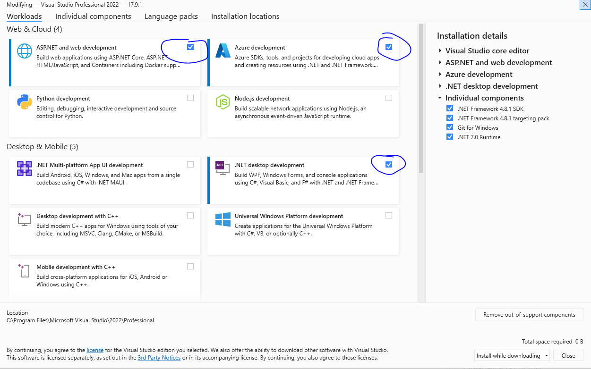

# Demoulas Profit Sharing API project

## Setup Instructions

### Getting Started

Install 3rd Party Libraries:

1. Visual Studio Professional 2026 (18.0.2) or higher installed - https://visualstudio.microsoft.com/downloads/

    

    - Install the "ASP.net and web development", "Azure" workload, and ".NET desktop development" workloads
    - If VS requires any additional workloads or packages, you will be prompted at startup.

1.1. OPTIONAL: JetBrains Rider 2025.3 or higher installed - https://www.jetbrains.com/rider/ 3. OPTIONAL - Latest version of Chrome web browser - https://www.google.com/chrome/

### Build and Test

1. Clone the git repository https://bitbucket.org/demoulas/smart-profit-sharing
2. Open the Demoulas.ProfitSharing solution
    - API Navigate to the \src\Services folder
    - Locate Demoulas.ProfitSharing.slnx and open with Visual Studio.
3. Set the 'Demoulas.ProfitSharing.AppHost' project as your startup project
    - Find the project, right click and choose "set as startup project"
4. Check for ArtifactoryCloud NuGet package source
    - Open a command prompt or terminal window.
    - run dotnet nuget list source
    - If "ArtifactoryCloud" is not in the list, read this [guide](https://demoulas.atlassian.net/wiki/spaces/JFD/pages/133726274/Add+Custom+NuGet+source+for+JFrog+Cloud) to add it.
        - reach out to a team member and get the connection details if needed.
5. Get secrets.json from one of the team members
    - [Safe storage of app secrets in development](https://learn.microsoft.com/en-us/aspnet/core/security/app-secrets?view=aspnetcore-8.0&tabs=windows#manage-user-secrets-with-visual-studio)
6. F5/Run, it's that simple.

# Note-worthy technology

1. [Safe storage of app secrets in development](https://learn.microsoft.com/en-us/aspnet/core/security/app-secrets?view=aspnetcore-8.0&tabs=windows#enable-secret-storage)
2. [Fast-Endpoints](https://fast-endpoints.com/) | [REPR Design Pattern](https://deviq.com/design-patterns/repr-design-pattern)
3. [EntityFramework.Core 10 w/Oracle](https://www.nuget.org/packages/Oracle.EntityFrameworkCore)
4. [.editorconfig](https://learn.microsoft.com/en-us/visualstudio/ide/create-portable-custom-editor-options?view=vs-2022)
5. [Directory.Build.Props](https://learn.microsoft.com/en-us/visualstudio/msbuild/customize-by-directory?view=vs-2022)
6. [Centralized package management](https://learn.microsoft.com/en-us/nuget/consume-packages/central-package-management)
7. [BenchmarkDotNet](https://benchmarkdotnet.org/)
8. [Makes use of .NET Aspire](https://learn.microsoft.com/en-us/dotnet/aspire/get-started/aspire-overview)
9. [Shouldly](https://docs.shouldly.org/)
10. [RabbitMq](https://hub.docker.com/r/masstransit/rabbitmq)
11. [Bogus](https://github.com/bchavez/Bogus)
12. [Riok.Mapperly](https://mapperly.riok.app)
13. [Serilog](https://serilog.net/)
14. [.NET Feature Management](https://github.com/microsoft/FeatureManagement-Dotnet)
15. [NetEscapades.AspNetCore.SecurityHeaders](https://github.com/andrewlock/NetEscapades.AspNetCore.SecurityHeaders)

### Suggested Visual Studio Extensions

- [Productivity Power Tools 2022](https://marketplace.visualstudio.com/items?itemName=VisualStudioPlatformTeam.ProductivityPowerPack2022)
- [Visual Studio Spell Checker (VS2022 and Later)](https://marketplace.visualstudio.com/items?itemName=EWoodruff.VisualStudioSpellCheckerVS2022andLater)

### Good reads

- [Minimal APIs overview](https://learn.microsoft.com/en-us/aspnet/core/fundamentals/minimal-apis/overview?view=aspnetcore-8.0)
- [RESTful web API design](https://learn.microsoft.com/en-us/azure/architecture/best-practices/api-design)
- [Web API implementation](https://learn.microsoft.com/en-us/azure/architecture/best-practices/api-implementation)
- [Caching guidance](https://learn.microsoft.com/en-us/azure/architecture/best-practices/caching)
- [Performance testing and antipatterns for cloud applications](https://learn.microsoft.com/en-us/azure/architecture/antipatterns/#catalog-of-antipatterns)
- [Use feature flags in an ASP.NET Core app](https://learn.microsoft.com/en-us/azure/azure-app-configuration/use-feature-flags-dotnet-core)
- [EF.Core Bulk updates](https://learn.microsoft.com/en-us/ef/core/what-is-new/ef-core-7.0/whatsnew#executeupdate-and-executedelete-bulk-updates)
- [Async return types (C#)](https://learn.microsoft.com/en-us/dotnet/csharp/asynchronous-programming/async-return-types)

### Databases

- Oracle

### EntityFramework Tools

dotnet tool update --global dotnet-ef

### EntityFramework Migrations

dotnet ef migrations add {migrationName} --context ProfitSharingDbContext
dotnet ef migrations script --context ProfitSharingDbContext --output {FILE}

### Manage the database

**In place upgrade**: Demoulas.ProfitSharing.Data.Cli upgrade-db --connection-name ProfitSharing
**Drop and rebuild schema**: Demoulas.ProfitSharing.Data.Cli drop-recreate-db --connection-name ProfitSharing
**Import from Ready**: Demoulas.ProfitSharing.Data.Cli import-from-ready --connection-name ProfitSharing --sql-file ".\src\database\ready_import\SQL copy all from ready to smart ps.sql" --source-schema "PROFITSHARE"

- Second Example: Demoulas.ProfitSharing.Data.Cli import-from-ready --connection-name ProfitSharing --sql-file "..\..\..\..\..\..\..\src\database\ready_import\SQL copy all from ready to smart ps.sql" --source-schema "PROFITSHARE"

**Generate dgml**: Demoulas.ProfitSharing.Data.Cli generate-dgml --connection-name ProfitSharing --output-file ProfitSharing.dgml
**Generate markdown**: Demoulas.ProfitSharing.Data.Cli generate-markdown --connection-name ProfitSharing --output-file ProfitSharing.dgml

# Docker Publish Example

## Reference [dotnet publish](https://learn.microsoft.com/en-us/dotnet/core/docker/publish-as-container?pivots=dotnet-8-0)

dotnet publish -c Release -p:PublishProfile=FolderProfile -o ./publishOutput
PowerShell -ExecutionPolicy Bypass -File .\utilities\generateBuildInfo.ps1

Compress-Archive -Path ./publishOutput/\* -DestinationPath ./Demoulas.ProfitSharing.Api.zip -Force

# Build command line

[dotnet build](https://learn.microsoft.com/en-us/dotnet/core/tools/dotnet-build)
[.NET Runtime Identifier Catalog](https://learn.microsoft.com/en-us/dotnet/core/rid-catalog)
using Powershell: dotnet build Demoulas.ProfitSharing.Api.csproj --configuration Release --runtime win-x64 /p:SourceRevisionId=$(git rev-parse --short HEAD)

# Run tests

dotnet test Demoulas.ProfitSharing.Tests.csproj --configuration debug
