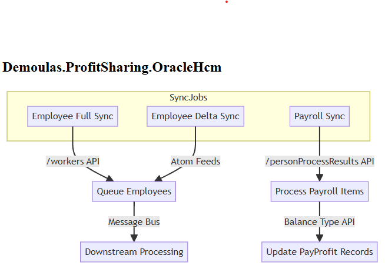

# Demoulas.ProfitSharing.OracleHcm

## Overview

This project integrates with Oracle HCM Cloud to synchronize employee and payroll data into the Profit Sharing system. It uses scheduled background jobs to perform full, delta, and payroll synchronizations, leveraging Oracle HCM REST APIs and Atom feeds.

---

## Major Processes & Workflows

### 1. **Employee Full Sync**

- **Purpose:** Retrieve all employee demographic data from Oracle HCM and queue it for processing.
- **Workflow:**
  - Scheduled by `EmployeeFullSyncService` (Quartz job).
  - Calls `EmployeeSyncService.ExecuteFullSyncAsync()`.
  - Uses `EmployeeFullSyncClient.GetAllEmployees()` to page through `/workers` API.
  - Queues batches of employees for downstream processing via message bus.
- **Performance:**
  - Uses small page sizes (50) to avoid timeouts, but this increases API calls.

### 2. **Employee Delta Sync**

- **Purpose:** Retrieve only changed employees (new hires, updates, terminations, assignments) since last sync.
- **Workflow:**
  - Scheduled by `EmployeeDeltaSyncService` (Quartz job).
  - Calls `EmployeeSyncService.ExecuteDeltaSyncAsync()`.
  - Uses `AtomFeedClient.GetFeedDataAsync()` for each feed type (newhire, empassignment, empupdate, termination).
  - Merges results, deduplicates by PersonId, and fetches current data for each.
  - Queues for downstream processing.
- **Performance/Issues:**
  - Atom feed page size is small (25), leading to many requests.
  - Feeds are processed sequentially, not in parallel.

### 3. **Payroll Sync**

- **Purpose:** Retrieve payroll process results and update profit sharing records.
- **Workflow:**
  - Scheduled by `EmployeePayrollSyncService` (Quartz job).
  - Calls `PayrollSyncClient.RetrievePayrollBalancesAsync()`.
  - Pages through `/personProcessResults` API for payroll actions.
  - For each payroll item, fetches balance types (dollars, hours, weeks) via additional API calls.
  - Updates or creates `PayProfit` records in the database.
- **Performance/Issues:**
  - For each payroll item, makes 3+ additional API calls (one per balance type).
  - No batching or parallelization of balance type requests.

---

## Diagram showing the major processes and their interactions

---

## See Also

- [Oracle HCM Workers API](https://docs.oracle.com/en/cloud/saas/human-resources/25b/farws/api-workers.html)
- [Oracle HCM Person Process Results API](https://docs.oracle.com/en/cloud/saas/human-resources/25b/farws/api-person-process-results.html)
- [Oracle HCM Atom Feeds](https://docs.oracle.com/en/cloud/saas/human-resources/25b/farws/atom-feeds.html)
